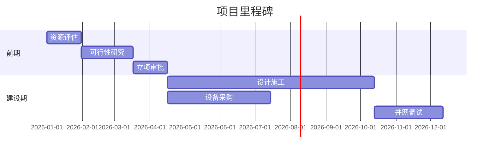

# 项目名称

> [!info] 项目概览
> - **项目类型**: 风电/光伏/储能
> - **装机规模**: 100 MW
> - **投资金额**: 5亿元
> - **项目地点**: 省份/地区
> - **当前阶段**: 前期开发

---

## 项目时间线

---

## 关键信息

### 资源评估
- [ ] 风资源/光资源测量
- [ ] 土地性质核查
- [ ] 电网接入条件
- [ ] 环境影响评估

### 审批进度
- [ ] 发改委备案
- [ ] 土地使用许可
- [ ] 环评批复
- [ ] 电网接入批复

### 合作方
| 角色 | 单位 | 联系人 | 状态 |
|------|------|--------|------|
| EPC总包 | 待定 | - | 招标中 |
| 设计院 | 待定 | - | 待确定 |
| 设备供应商 | 待定 | - | 待确定 |

---

## 会议记录

### 2026-03-XX 项目启动会
**参会人员**: 
**会议要点**:
- 
- 

**待办事项**:
- [ ] 
- [ ] 

---

## 相关文件

- [[项目可行性研究报告]]
- [[土地租赁协议]]
- [[电网接入意向书]]

---

## 备注

%% 内部备注，不对外显示 %%

项目风险点：
1. 
2. 

下一步行动：
- 
